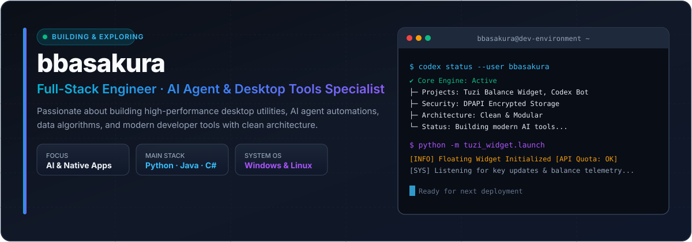
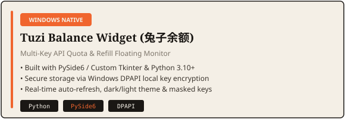
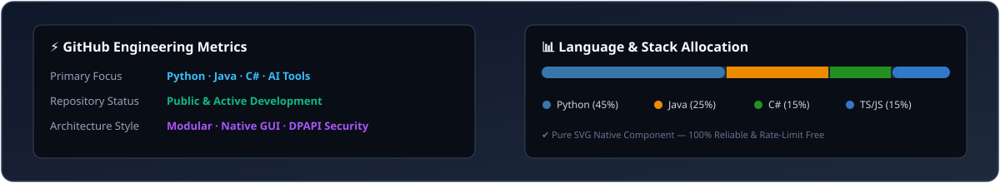
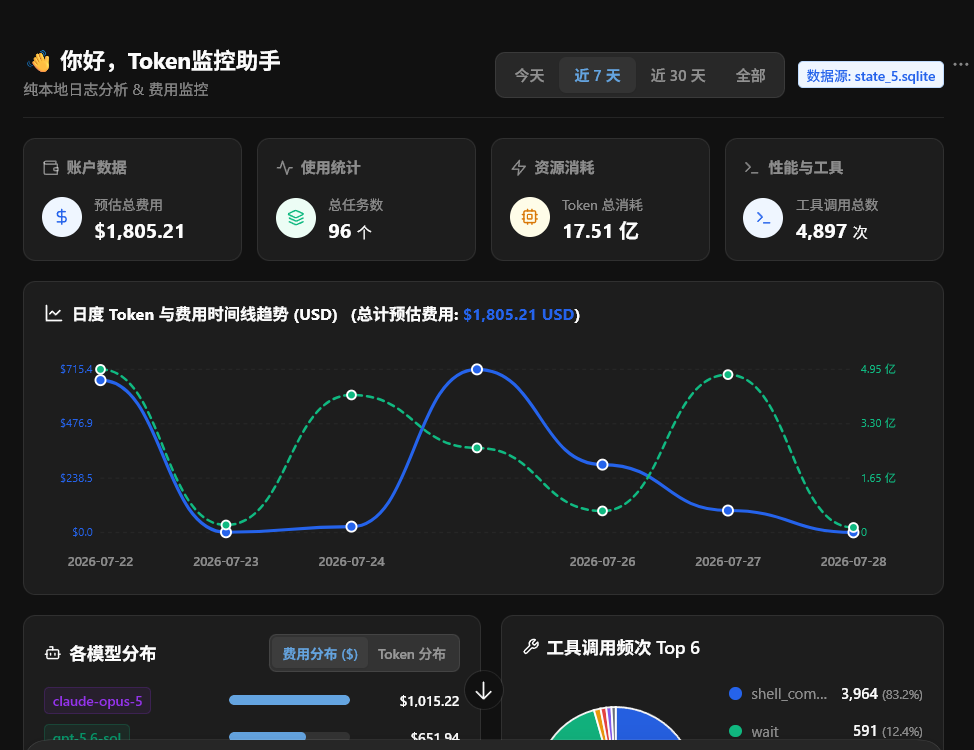

<div align="center">

<!-- MoonInAI Language Switcher Badges -->
<a href="README.md"></a>
<a href="README.zh-CN.md"></a>

<br/><br/>



</div>

<br/>


### 💡 Core Philosophy & Engineering Focus

- 🚀 **Desktop Utilities & Automation**: Crafting high-efficiency, native Windows & cross-platform applications (Python, C#, PySide/Qt, Node.js).
- 🤖 **AI Infrastructure & Agents**: Building custom AI Agent automations, proxy routing, token telemetry, and workflow integration.
- ⚡ **Clean Architecture & Data Systems**: Focusing on local privacy, DPAPI key security, modular designs, and high-performance algorithms.

```text
Identity   : Full-Stack Engineer & AI Automation Craftsman
Location   : China (UTC+8)
Primary OS : Windows 11 / Linux (WSL2 / Ubuntu)
Palette    : MoonInAI Editorial (Paper #F4EFE6 · Ink #1A1714 · Orange #F0652E)
Interests  : AI Agents · Desktop Widgets · Quantitative Indicators · System Optimization
```

<br/>


<div align="center">

#### 💻 Programming Languages


#### 🛠️ Frameworks & GUI Libraries


#### 🤖 AI & Automation Stack


</div>

<br/>


<div align="center">

| Project Showcase | Focus & Architecture |
| :--- | :--- |
|  | **Windows Native API Quota & Refill Monitor**<br/>• Multi-Key reseller API balance tracking<br/>• Windows DPAPI local key encryption<br/>• Dual theme support & zero-dependency deployment |
| <a href="https://github.com/bbasakura/codex-token-monitor"></a> | **Multi-Account Model & Token Telemetry**<br/>• OpenAI & Antigravity account quota analytics<br/>• Intelligent auto-switcher & Desktop float widget<br/>• Local cockpit dashboard & usage ranking |

</div>

<br/>


<div align="center">




<div align="center">

| Token Monitor Dashboard Preview |
| :---: |
|  |

</div>


</div>

<br/>

---

<div align="center">

<sub>Designed with <a href="https://github.com/oil-oil/beautify-github-readme">beautify-github-readme</a> · Styled in <a href="docs/MoonInAI-配色拆解与设计系统指南.md">MoonInAI Editorial Spec</a> · Maintained by <a href="https://github.com/bbasakura">@bbasakura</a></sub>

</div>
