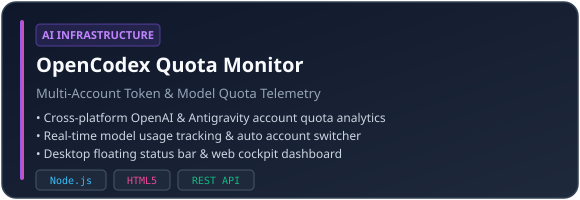

<div align="center">

<!-- 中英文切换按钮 -->
<a href="README.md"></a>
<a href="README.zh-CN.md"></a>

<br/><br/>


</div>

<br/>


### 💡 核心理念与工程方向

- 🚀 **桌面工具与自动化开发**：专注于构建高性能、原生的 Windows 悬浮组件与跨平台实用工具（Python, C#, PySide/Qt, Node.js）。
- 🤖 **AI 基础设施与 Agent 工具链**：开发智能 AI Agent 工作流、多账号 Token 额度监控、模型代理路由与数据看板。
- ⚡ **安全架构与数据系统**：重视本地数据隐私保护、Windows DPAPI 密钥加密存储、模块化设计与高并发量能算法。

```text
开发者身份 : 全栈工程师 · AI 自动化与桌面应用开发者
所在地区   : 中国 (UTC+8)
常用操作系统 : Windows 11 / Linux (WSL2 / Ubuntu)
技术兴趣   : AI Agent 智能体 · 桌面小组件 · 核心量能指标 · 系统工程优化
```

<br/>


<div align="center">

#### 💻 编程语言


#### 🛠️ 框架与 GUI 界面库


#### 🤖 AI 与自动化技术栈


</div>

<br/>


<div align="center">

| 项目展示 | 架构特色与核心功能 |
| :--- | :--- |
|  | **Windows 原生 API 额度与加油包悬浮监控**<br/>• 支持 1–20 个 reseller Key 并发额度与到期时间查询<br/>• 基于 Windows DPAPI 本地密匙加密保护<br/>• 深浅色主题同步与脱敏展示，零第三方依赖 |
|  | **多账号 Model 与 Token 配额统计**<br/>• 全平台 OpenAI 与 Antigravity 账号配额监控<br/>• 智能自动切号指令与桌面悬浮窗<br/>• 本地 Web 仪表盘与今日使用量排行分析 |

</div>

<br/>


<div align="center">


</div>

<br/>

---

<div align="center">

<sub>使用 <a href="https://github.com/oil-oil/beautify-github-readme">beautify-github-readme</a> 精心设计 · 由 <a href="https://github.com/bbasakura">@bbasakura</a> 维护</sub>

</div>
