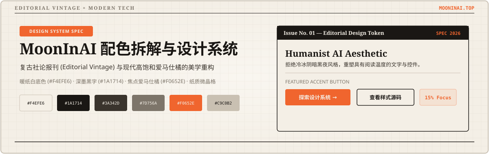
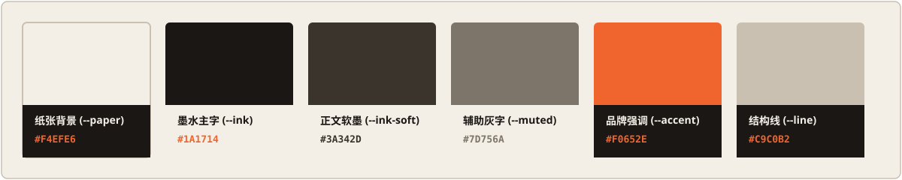

<div align="center">



</div>

<br/>

> **设计理念摘要**：这份指南系统化拆解了 `mooninai.top` 网站的视觉设计与 CSS Token。MoonInAI 采用了**复古社论报刊 (Editorial Vintage) × 现代科技橘 (Modern Tech Accent)** 的撞色方案，摒弃了常规 AI 网站偏爱的极冷黑白或夜间霓虹风格，转而采用温暖、具备人文沉淀感的微泛黄纸张底色与深墨色基调。

---

<br/>


<br/>

<div align="center">



</div>

### 1.1 品牌与基础色值盘 (Palette Tokens)

| 角色 (Role) | 变量名 (CSS Token) | 十六进制 (HEX) | RGB 值 | 视觉心理与使用场景 |
| :--- | :--- | :--- | :--- | :--- |
| 📄 **纸张背景** | `--paper` | `#F4EFE6` | `244, 239, 230` | 暖调轻型纸底色，替代冷白 `#FFFFFF`，营造复古印品舒适感 |
| ✒️ **墨水主字** | `--ink` | `#1A1714` | `26, 23, 20` | 深黑褐色墨色，替代纯黑 `#000000`，降低视觉疲劳与生硬感 |
| 📝 **正文软墨** | `--ink-soft` | `#3A342D` | `58, 52, 45` | 软墨色，用于段落正文、多行描述与注释文本 |
| 🏷️ **辅助灰字** | `--muted` | `#7D756A` | `125, 117, 106` | 中性暖灰，用于时间戳、次要 Label、分类标签 |
| 🍊 **品牌强调** | `--accent` | `#F0652E` | `240, 101, 46` | 爱马仕暖橘/珊瑚橘，高饱和视觉焦点（用于 CTA / 按钮 / 高亮） |
| 🔥 **悬停按压** | `--accent-dark` | `#D94F1F` | `217, 79, 31` | 深暖橘色，用于 Action 控件的 Hover / Active 交互态 |
| 📐 **结构分割** | `--line` | `#C9C0B2` | `201, 192, 178` | 暖灰褐色线条，用于卡片边框、分隔横线、网格分隔 |

### 1.2 透明度与遮罩色 (Overlay & Alpha Colors)

- 橙色高亮背景：`rgba(240, 101, 46, 0.08)` / `rgba(240, 101, 46, 0.11)`（用于 Badge 背景与悬浮卡片高亮区）
- 边框弱化线条：`rgba(201, 192, 178, 0.14)`（用于内嵌表格或轻微分隔线）
- 深色遮罩图层：`rgba(26, 23, 20, 0.025)`（用于全局细微噪点与微晶格纹理）

<br/>


网站的排版采用了**经典衬线标题 + 清爽无衬线正文**的复古报刊组合：

### 2.1 字体族 (Font Families)

```css
:root {
  /* 西文衬线体 / 中文衬线体（用于 Hero 大标题、核心观点） */
  --serif: 'Playfair Display', 'Noto Serif SC', Georgia, serif;
  --serif-cjk: 'Noto Serif SC', 'Playfair Display', serif;

  /* 无衬线体（用于正文、导航栏、按钮、UI 控件） */
  --sans: 'Inter', 'Noto Sans SC', system-ui, sans-serif;
  --sans-cjk: 'Noto Sans SC', 'Inter', sans-serif;

  /* 代码与数据等宽体 */
  --mono: ui-monospace, 'SF Mono', 'Menlo', 'Roboto Mono', monospace;
}
```

<br/>


### 3.1 核心美学特征

1. 📰 **报刊社论质感 (Editorial & Build in Public)**
   - 使用硬朗单色线条 (`1px solid var(--line)`) 替代浮夸的弥散模糊阴影 (`box-shadow`)。
   - 大量使用网格 track 与清晰的板块切分，保持视觉结构严密紧凑。
2. 📜 **物理纸质微纹理 (Texture & Grain)**
   - 网页背景叠加了微弱的点状晶格（`radial-gradient`）和约 4.5% 透明度的微噪点，打破了数字屏幕的平坦感。
3. 🎯 **强对比焦点引导 (High-contrast Action Spotlights)**
   - 全局 85% 面积保留在暖纸白 `--paper` 与墨黑 `--ink` 之间，仅在 15% 的核心转化点（CTA 按钮、核心 Tag、数据亮点）注入高饱和爱马仕橘 `--accent`。

<br/>


### 4.1 按钮 (Buttons)

- **主行动按钮 (Primary CTA)**
  - 背景：`var(--accent)` (`#F0652E`)
  - 文字：`var(--paper)` (`#F4EFE6`)
  - Hover：背景变为 `var(--accent-dark)` (`#D94F1F`)
- **次级鬼影按钮 (Ghost Button)**
  - 背景：透明 / `var(--paper)`
  - 边框：`1px solid var(--ink)`
  - 文字：`var(--ink)`
  - Hover：背景填充变为 `var(--accent)`，文字变为 `var(--paper)`，边框变为 `var(--accent)`

### 4.2 卡片与容器 (Cards & Containers)

- 背景：`var(--paper)` 或稍深的低饱和衬底
- 边框：`1px solid var(--line)` (`#C9C0B2`)
- 圆角：偏向硬朗小圆角 (`border-radius: 4px` 到 `8px`) 或直角
- 阴影：无阴影或极浅硬边阴影 (`3px 3px 0px var(--line)`)

<br/>


### 5.1 原生 CSS 变量配置 (`styles.css`)

```css
:root {
  /* 配色 Token */
  --paper: #F4EFE6;
  --ink: #1A1714;
  --ink-soft: #3A342D;
  --muted: #7D756A;
  --accent: #F0652E;
  --accent-dark: #D94F1F;
  --line: #C9C0B2;

  /* 字体 Token */
  --font-serif: 'Playfair Display', 'Noto Serif SC', Georgia, serif;
  --font-sans: 'Inter', 'Noto Sans SC', system-ui, sans-serif;
  --font-mono: ui-monospace, 'SF Mono', monospace;
}

/* 全局纸质微纹理 */
body {
  background-color: var(--paper);
  color: var(--ink);
  font-family: var(--font-sans);
  background-image: radial-gradient(rgba(26, 23, 20, 0.025) 1px, transparent 1px);
  background-size: 4px 4px;
}
```

### 5.2 Tailwind CSS 配置 (`tailwind.config.js`)

```javascript
/** @type {import('tailwindcss').Config} */
module.exports = {
  theme: {
    extend: {
      colors: {
        paper: '#F4EFE6',
        ink: {
          DEFAULT: '#1A1714',
          soft: '#3A342D',
          muted: '#7D756A',
        },
        accent: {
          DEFAULT: '#F0652E',
          dark: '#D94F1F',
        },
        line: '#C9C0B2',
      },
      fontFamily: {
        serif: ['"Playfair Display"', '"Noto Serif SC"', 'Georgia', 'serif'],
        sans: ['"Inter"', '"Noto Sans SC"', 'system-ui', 'sans-serif'],
        mono: ['ui-monospace', '"SF Mono"', 'monospace'],
      },
    },
  },
  plugins: [],
}
```

<br/>

---

### 💡 6. 搭配建议与实践注意事项

1. **避免过度使用纯白与纯黑**：在使用该色彩体系时，所有容器背景应优先使用 `--paper`（`#F4EFE6`），避免混入纯白色 `#FFFFFF` 块，保持报刊印品的沉浸感。
2. **严格控制橘色比重**：`--accent`（`#F0652E`）视觉穿透力强，页面中同时出现的橘色元素不要超过 3–4 处，集中在主行动按钮、核心数据和高亮 Tag。
3. **搭配纤细线条图标**：配合 1.5px 粗细的单色图标（如 Lucide / Heroicons），能最大化体现社论智识感与现代科技精致度。

<br/>

<div align="center">

<sub>Designed with <a href="https://github.com/oil-oil/beautify-github-readme">beautify-github-readme</a> · Editorial Design Spec</sub>

</div>
